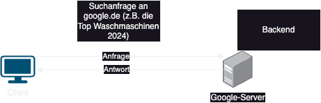

# 24-11-Wiki

## Frontend vs. Backend

- `Frontend` : Die Ansicht für den Benutzer/Benutzeroberfläche, Design und Layout. Interaktionen des Benutzers
- `Backend`: Der Benutzer sieht die Backend Services nicht bzw. interagiert damit nicht direkt
- `Client`: Das Benutzerendgerät
- `Server`: ist ein Gerät, das Anfragen von Clients verarbeitet und die angeforderten Dienste bereitstellt

## Internet

- `Internet`: Globales Netzwerk, welches die weltweite Kommunikation ermöglicht durch den Zusammenschluss von Servern ermöglicht.

## Pfade

- `absoluter Pfad`: Geht von dem Ursprung des Dateisystems aus (auf Windows wäre das `C://`)
- `relativer Pfad`:Geht von dem Verzeichnis aus, in welchem ihr euch befindet. Startet mit `./`

## Entwicklungsumgebung

- `IDE`: Die Applikation, in welcher ihr den Code entwickelt. **Visual Studio Code** wäre ein Beispiel

## Software vs. Hardware vs. Betriebssystem

- `Software`: Programm/Anwendungen. Man kann Software nicht anfassen
- `Hardware`: Physische Komponenten des Computers/Server. Zum Beispiel CPU wäre eine Hardware Komponente
- `Betriebssystem bzw. OS`: Windows, Android, iOS. Schnittstelle zwischen Hardware und Software

## Hardware Komponenten

- `CPU`: Central Processing Unit - Prozessor
- `RAM`: Random Access Memory - Arbeitsspeicher. Kurzzeitspeicher
